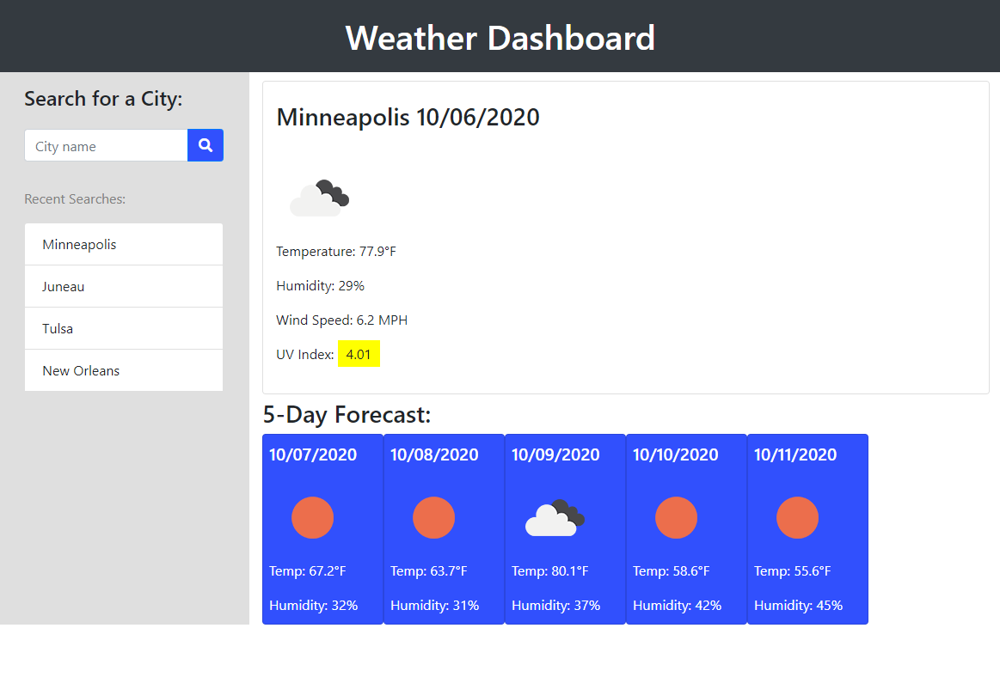

# Weather Dashboard
An application to search for a city and view its weather conditions &amp; forecast.

## Find this project at: 

https://github.com/LindseyM20/weather-dashboard

https://lindseym20.github.io/weather-dashboard/

## Description:

Here you will find files for a web application that allows the user to look up the current weather and 5-day forecast in any city. 

Dynamically updated CSS and Bootstrap lend a clean display of weather details. Utilizing local storage, the JavaScript and JQuery assure that the up-to-date weather of the user's most recently searched city displays when the page is refreshed or reopened. The date is kept current using the Moment.js library, and real-time weather data is retrieved using AJAX calls to the Open Weather Map API.

## Installation:

N/A

## Usage Instructions:

To use this program, use your browser to go to https://lindseym20.github.io/weather-dashboard/.

Type a city in the text field, or choose a city from the list once you have searched cities. 

## Credits:

Thank you to my great support system of peers, TAs, tutor, and instructors through the U of M Coding Bootcamp!

In particular:

https://github.com/dfkestner

https://github.com/aanderson120

https://github.com/b-audette

## License:

The Unlicense
